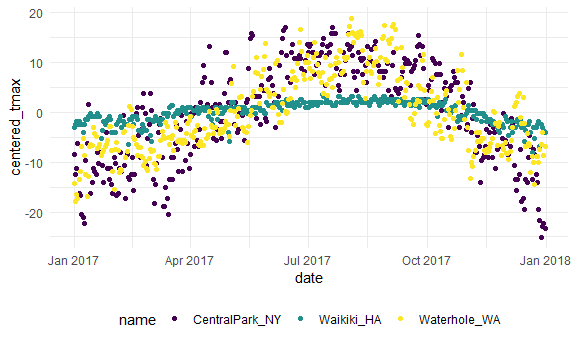

Exploratory Analysis
================

``` r
library(tidyverse)
```

    ## -- Attaching packages ----------------------------------------------- tidyverse 1.3.0 --

    ## v ggplot2 3.3.2     v purrr   0.3.4
    ## v tibble  3.0.3     v dplyr   1.0.2
    ## v tidyr   1.1.2     v stringr 1.4.0
    ## v readr   1.3.1     v forcats 0.5.0

    ## -- Conflicts -------------------------------------------------- tidyverse_conflicts() --
    ## x dplyr::filter() masks stats::filter()
    ## x dplyr::lag()    masks stats::lag()

``` r
library(patchwork)
```

Global settings for themes (for figures).

``` r
knitr::opts_chunk$set(
  fig.width = 6,
  fig.asp = .6,          #aspect ratio: height over width
  out.width = "90%"      # figure doesn't go all the way out on full(100%) page
)
theme_set(theme_minimal() + theme(legend.position = "bottom"))

options(
  ggplot2.continuous.colour = "viridis", # to override ggplot default colors.
  ggplot2.continuous.fill = "viridis"
)

scale_colour_discrete = scale_colour_viridis_d
scale_fill_discrete = scale_fill_viridis_d
```

Load NOAA weather data, and add month variable.

``` r
weather_df =  
  rnoaa::meteo_pull_monitors(
    c("USW00094728", "USC00519397", "USS0023B17S"),
    var = c("PRCP", "TMIN", "TMAX"), 
    date_min = "2017-01-01",
    date_max = "2017-12-31") %>%
  mutate(
    name = recode(
      id, 
      USW00094728 = "CentralPark_NY", 
      USC00519397 = "Waikiki_HA",
      USS0023B17S = "Waterhole_WA"),
    tmin = tmin / 10,
    tmax = tmax / 10,
    month = lubridate::floor_date(date, unit = "month")) %>% #package to add month var
  select(name, id, everything())
```

    ## Registered S3 method overwritten by 'hoardr':
    ##   method           from
    ##   print.cache_info httr

    ## using cached file: C:\Users\arunp\AppData\Local\cache/R/noaa_ghcnd/USW00094728.dly

    ## date created (size, mb): 2020-10-03 16:57:15 (7.537)

    ## file min/max dates: 1869-01-01 / 2020-10-31

    ## using cached file: C:\Users\arunp\AppData\Local\cache/R/noaa_ghcnd/USC00519397.dly

    ## date created (size, mb): 2020-10-03 16:57:25 (1.703)

    ## file min/max dates: 1965-01-01 / 2020-03-31

    ## using cached file: C:\Users\arunp\AppData\Local\cache/R/noaa_ghcnd/USS0023B17S.dly

    ## date created (size, mb): 2020-10-03 16:57:29 (0.882)

    ## file min/max dates: 1999-09-01 / 2020-10-31

group\_by name and month

``` r
weather_df %>%
  group_by(name, month)
```

    ## # A tibble: 1,095 x 7
    ## # Groups:   name, month [36]
    ##    name           id          date        prcp  tmax  tmin month     
    ##    <chr>          <chr>       <date>     <dbl> <dbl> <dbl> <date>    
    ##  1 CentralPark_NY USW00094728 2017-01-01     0   8.9   4.4 2017-01-01
    ##  2 CentralPark_NY USW00094728 2017-01-02    53   5     2.8 2017-01-01
    ##  3 CentralPark_NY USW00094728 2017-01-03   147   6.1   3.9 2017-01-01
    ##  4 CentralPark_NY USW00094728 2017-01-04     0  11.1   1.1 2017-01-01
    ##  5 CentralPark_NY USW00094728 2017-01-05     0   1.1  -2.7 2017-01-01
    ##  6 CentralPark_NY USW00094728 2017-01-06    13   0.6  -3.8 2017-01-01
    ##  7 CentralPark_NY USW00094728 2017-01-07    81  -3.2  -6.6 2017-01-01
    ##  8 CentralPark_NY USW00094728 2017-01-08     0  -3.8  -8.8 2017-01-01
    ##  9 CentralPark_NY USW00094728 2017-01-09     0  -4.9  -9.9 2017-01-01
    ## 10 CentralPark_NY USW00094728 2017-01-10     0   7.8  -6   2017-01-01
    ## # ... with 1,085 more rows

Count number of observations in each month.

``` r
weather_df %>%
  group_by(month) %>%
  summarize(n_obs = n())
```

    ## `summarise()` ungrouping output (override with `.groups` argument)

    ## # A tibble: 12 x 2
    ##    month      n_obs
    ##    <date>     <int>
    ##  1 2017-01-01    93
    ##  2 2017-02-01    84
    ##  3 2017-03-01    93
    ##  4 2017-04-01    90
    ##  5 2017-05-01    93
    ##  6 2017-06-01    90
    ##  7 2017-07-01    93
    ##  8 2017-08-01    93
    ##  9 2017-09-01    90
    ## 10 2017-10-01    93
    ## 11 2017-11-01    90
    ## 12 2017-12-01    93

Group and summarize by two variables

``` r
weather_df %>%
  group_by(name, month) %>%
  summarize(n_obs = n())
```

    ## `summarise()` regrouping output by 'name' (override with `.groups` argument)

    ## # A tibble: 36 x 3
    ## # Groups:   name [3]
    ##    name           month      n_obs
    ##    <chr>          <date>     <int>
    ##  1 CentralPark_NY 2017-01-01    31
    ##  2 CentralPark_NY 2017-02-01    28
    ##  3 CentralPark_NY 2017-03-01    31
    ##  4 CentralPark_NY 2017-04-01    30
    ##  5 CentralPark_NY 2017-05-01    31
    ##  6 CentralPark_NY 2017-06-01    30
    ##  7 CentralPark_NY 2017-07-01    31
    ##  8 CentralPark_NY 2017-08-01    31
    ##  9 CentralPark_NY 2017-09-01    30
    ## 10 CentralPark_NY 2017-10-01    31
    ## # ... with 26 more rows

Or, use “count”.

``` r
weather_df %>%
  count(month, name = "n_obs")
```

    ## # A tibble: 12 x 2
    ##    month      n_obs
    ##    <date>     <int>
    ##  1 2017-01-01    93
    ##  2 2017-02-01    84
    ##  3 2017-03-01    93
    ##  4 2017-04-01    90
    ##  5 2017-05-01    93
    ##  6 2017-06-01    90
    ##  7 2017-07-01    93
    ##  8 2017-08-01    93
    ##  9 2017-09-01    90
    ## 10 2017-10-01    93
    ## 11 2017-11-01    90
    ## 12 2017-12-01    93

Summarize: number of observations in each month and number of distinct
values of date in each month(e.g. feb = will have 28 days).

``` r
weather_df %>%
  group_by(month) %>%
  summarize(
    n_obs = n(),
    n_days = n_distinct(date))
```

    ## `summarise()` ungrouping output (override with `.groups` argument)

    ## # A tibble: 12 x 3
    ##    month      n_obs n_days
    ##    <date>     <int>  <int>
    ##  1 2017-01-01    93     31
    ##  2 2017-02-01    84     28
    ##  3 2017-03-01    93     31
    ##  4 2017-04-01    90     30
    ##  5 2017-05-01    93     31
    ##  6 2017-06-01    90     30
    ##  7 2017-07-01    93     31
    ##  8 2017-08-01    93     31
    ##  9 2017-09-01    90     30
    ## 10 2017-10-01    93     31
    ## 11 2017-11-01    90     30
    ## 12 2017-12-01    93     31

2 x 2 tables: tidy

``` r
weather_df %>% 
  mutate(
    cold = case_when(
      tmax <  5 ~ "cold",
      tmax >= 5 ~ "not_cold",
      TRUE      ~ ""
  )) %>% 
  filter(name != "Waikiki_HA") %>% 
  group_by(name, cold) %>% 
  summarize(count = n())
```

    ## `summarise()` regrouping output by 'name' (override with `.groups` argument)

    ## # A tibble: 4 x 3
    ## # Groups:   name [2]
    ##   name           cold     count
    ##   <chr>          <chr>    <int>
    ## 1 CentralPark_NY cold        44
    ## 2 CentralPark_NY not_cold   321
    ## 3 Waterhole_WA   cold       172
    ## 4 Waterhole_WA   not_cold   193

reorganize to standard (untidy)table, using pivot\_wider or
janitor::tabyl

``` r
weather_df %>% 
  mutate(cold = case_when(
    tmax <  5 ~ "cold",
    tmax >= 5 ~ "not_cold",
    TRUE     ~ ""
  )) %>% 
  filter(name != "Waikiki_HA") %>% 
  janitor::tabyl(name, cold)
```

    ##            name cold not_cold
    ##  CentralPark_NY   44      321
    ##    Waterhole_WA  172      193

General summaries

``` r
weather_df %>%
  group_by(month) %>%
  summarize(
    mean_tmax = mean(tmax),
    mean_prec = mean(prcp, na.rm = TRUE),
    median_tmax = median(tmax),
    sd_tmax = sd(tmax))
```

    ## `summarise()` ungrouping output (override with `.groups` argument)

    ## # A tibble: 12 x 5
    ##    month      mean_tmax mean_prec median_tmax sd_tmax
    ##    <date>         <dbl>     <dbl>       <dbl>   <dbl>
    ##  1 2017-01-01      10.8     37.0          6.1   13.1 
    ##  2 2017-02-01      12.2     57.9          8.3   12.1 
    ##  3 2017-03-01      13.0     54.6          8.3   12.4 
    ##  4 2017-04-01      17.3     32.9         18.3   11.2 
    ##  5 2017-05-01      NA       28.4         NA     NA   
    ##  6 2017-06-01      23.5     18.7         27.2    8.73
    ##  7 2017-07-01      NA       12.7         NA     NA   
    ##  8 2017-08-01      26.3     10.2         27.2    5.87
    ##  9 2017-09-01      23.8      9.94        26.1    8.42
    ## 10 2017-10-01      20.1     41.5         22.2    9.75
    ## 11 2017-11-01      14.0     61.5         12.0   11.6 
    ## 12 2017-12-01      11.0     40.2          8.9   11.9

Summaries with 2 variables.

``` r
weather_df %>%
  group_by(name, month) %>%
  summarize(
    mean_tmax = mean(tmax),
    median_tmax = median(tmax))
```

    ## `summarise()` regrouping output by 'name' (override with `.groups` argument)

    ## # A tibble: 36 x 4
    ## # Groups:   name [3]
    ##    name           month      mean_tmax median_tmax
    ##    <chr>          <date>         <dbl>       <dbl>
    ##  1 CentralPark_NY 2017-01-01      5.98         6.1
    ##  2 CentralPark_NY 2017-02-01      9.28         8.3
    ##  3 CentralPark_NY 2017-03-01      8.22         8.3
    ##  4 CentralPark_NY 2017-04-01     18.3         18.3
    ##  5 CentralPark_NY 2017-05-01     20.1         19.4
    ##  6 CentralPark_NY 2017-06-01     26.3         27.2
    ##  7 CentralPark_NY 2017-07-01     28.7         29.4
    ##  8 CentralPark_NY 2017-08-01     27.2         27.2
    ##  9 CentralPark_NY 2017-09-01     25.4         26.1
    ## 10 CentralPark_NY 2017-10-01     21.8         22.2
    ## # ... with 26 more rows

Summarize multiple columns with “across”.

``` r
weather_df %>%
  group_by(name, month) %>%
  summarize(across(tmin:prcp, mean))
```

    ## `summarise()` regrouping output by 'name' (override with `.groups` argument)

    ## # A tibble: 36 x 5
    ## # Groups:   name [3]
    ##    name           month        tmin  tmax  prcp
    ##    <chr>          <date>      <dbl> <dbl> <dbl>
    ##  1 CentralPark_NY 2017-01-01  0.748  5.98  39.5
    ##  2 CentralPark_NY 2017-02-01  1.45   9.28  22.5
    ##  3 CentralPark_NY 2017-03-01 -0.177  8.22  43.0
    ##  4 CentralPark_NY 2017-04-01  9.66  18.3   32.5
    ##  5 CentralPark_NY 2017-05-01 12.2   20.1   52.3
    ##  6 CentralPark_NY 2017-06-01 18.2   26.3   40.4
    ##  7 CentralPark_NY 2017-07-01 21.0   28.7   34.3
    ##  8 CentralPark_NY 2017-08-01 19.5   27.2   27.4
    ##  9 CentralPark_NY 2017-09-01 17.4   25.4   17.0
    ## 10 CentralPark_NY 2017-10-01 13.9   21.8   34.3
    ## # ... with 26 more rows

Creat a plot based on monthly summary.

``` r
weather_df %>%
  group_by(name, month) %>%
  summarize(mean_tmax = mean(tmax)) %>%
  ggplot(aes(x = month, y = mean_tmax, color = name)) + 
    geom_point() + geom_line() + 
    theme(legend.position = "bottom")
```

    ## `summarise()` regrouping output by 'name' (override with `.groups` argument)

    ## Warning: Removed 2 rows containing missing values (geom_point).


“Mutate” with “group\_by”: e.g compare daily max temp to annual average
max temp

``` r
weather_df %>%
  group_by(name) %>%
  mutate(
    mean_tmax = mean(tmax, na.rm = TRUE),
    centered_tmax = tmax - mean_tmax) %>% 
  ggplot(aes(x = date, y = centered_tmax, color = name)) + 
    geom_point() 
```

    ## Warning: Removed 3 rows containing missing values (geom_point).



Window functions: Ranking

``` r
weather_df %>%
  group_by(name, month) %>%
  mutate(temp_ranking = min_rank(tmax)) # to get max temp within month
```

    ## # A tibble: 1,095 x 8
    ## # Groups:   name, month [36]
    ##    name          id         date        prcp  tmax  tmin month      temp_ranking
    ##    <chr>         <chr>      <date>     <dbl> <dbl> <dbl> <date>            <int>
    ##  1 CentralPark_~ USW000947~ 2017-01-01     0   8.9   4.4 2017-01-01           22
    ##  2 CentralPark_~ USW000947~ 2017-01-02    53   5     2.8 2017-01-01           12
    ##  3 CentralPark_~ USW000947~ 2017-01-03   147   6.1   3.9 2017-01-01           15
    ##  4 CentralPark_~ USW000947~ 2017-01-04     0  11.1   1.1 2017-01-01           27
    ##  5 CentralPark_~ USW000947~ 2017-01-05     0   1.1  -2.7 2017-01-01            5
    ##  6 CentralPark_~ USW000947~ 2017-01-06    13   0.6  -3.8 2017-01-01            4
    ##  7 CentralPark_~ USW000947~ 2017-01-07    81  -3.2  -6.6 2017-01-01            3
    ##  8 CentralPark_~ USW000947~ 2017-01-08     0  -3.8  -8.8 2017-01-01            2
    ##  9 CentralPark_~ USW000947~ 2017-01-09     0  -4.9  -9.9 2017-01-01            1
    ## 10 CentralPark_~ USW000947~ 2017-01-10     0   7.8  -6   2017-01-01           21
    ## # ... with 1,085 more rows

``` r
#day with the lowest max temperature within each month:
weather_df %>%
  group_by(name, month) %>%
  filter(min_rank(tmax) < 2)
```

    ## # A tibble: 42 x 7
    ## # Groups:   name, month [36]
    ##    name           id          date        prcp  tmax  tmin month     
    ##    <chr>          <chr>       <date>     <dbl> <dbl> <dbl> <date>    
    ##  1 CentralPark_NY USW00094728 2017-01-09     0  -4.9  -9.9 2017-01-01
    ##  2 CentralPark_NY USW00094728 2017-02-10     0   0    -7.1 2017-02-01
    ##  3 CentralPark_NY USW00094728 2017-03-15     0  -3.2  -6.6 2017-03-01
    ##  4 CentralPark_NY USW00094728 2017-04-01     0   8.9   2.8 2017-04-01
    ##  5 CentralPark_NY USW00094728 2017-05-13   409  11.7   7.2 2017-05-01
    ##  6 CentralPark_NY USW00094728 2017-06-06    15  14.4  11.1 2017-06-01
    ##  7 CentralPark_NY USW00094728 2017-07-25     0  21.7  16.7 2017-07-01
    ##  8 CentralPark_NY USW00094728 2017-08-29    74  20    16.1 2017-08-01
    ##  9 CentralPark_NY USW00094728 2017-09-30     0  18.9  12.2 2017-09-01
    ## 10 CentralPark_NY USW00094728 2017-10-31     0  13.9   7.2 2017-10-01
    ## # ... with 32 more rows

``` r
#three days with the highest max temperature:
weather_df %>%
  group_by(name, month) %>%
  filter(min_rank(desc(tmax)) < 4)
```

    ## # A tibble: 149 x 7
    ## # Groups:   name, month [36]
    ##    name           id          date        prcp  tmax  tmin month     
    ##    <chr>          <chr>       <date>     <dbl> <dbl> <dbl> <date>    
    ##  1 CentralPark_NY USW00094728 2017-01-12    13  18.9   8.3 2017-01-01
    ##  2 CentralPark_NY USW00094728 2017-01-13     0  16.7   0   2017-01-01
    ##  3 CentralPark_NY USW00094728 2017-01-26     5  13.3   6.1 2017-01-01
    ##  4 CentralPark_NY USW00094728 2017-02-19     0  18.3  11.7 2017-02-01
    ##  5 CentralPark_NY USW00094728 2017-02-23     0  18.3   6.7 2017-02-01
    ##  6 CentralPark_NY USW00094728 2017-02-24     0  21.1  14.4 2017-02-01
    ##  7 CentralPark_NY USW00094728 2017-03-01    30  21.1  12.2 2017-03-01
    ##  8 CentralPark_NY USW00094728 2017-03-02     0  17.8   1.7 2017-03-01
    ##  9 CentralPark_NY USW00094728 2017-03-25     3  16.7   5.6 2017-03-01
    ## 10 CentralPark_NY USW00094728 2017-04-16     0  30.6  15   2017-04-01
    ## # ... with 139 more rows

Offsets:e.g. to find the day-by-day change in max temp within each
station over the year.

``` r
weather_df %>%
  group_by(name) %>%
  mutate(temp_change = tmax - lag(tmax)) # gives temp change from previous day
```

    ## # A tibble: 1,095 x 8
    ## # Groups:   name [3]
    ##    name           id         date        prcp  tmax  tmin month      temp_change
    ##    <chr>          <chr>      <date>     <dbl> <dbl> <dbl> <date>           <dbl>
    ##  1 CentralPark_NY USW000947~ 2017-01-01     0   8.9   4.4 2017-01-01      NA    
    ##  2 CentralPark_NY USW000947~ 2017-01-02    53   5     2.8 2017-01-01      -3.9  
    ##  3 CentralPark_NY USW000947~ 2017-01-03   147   6.1   3.9 2017-01-01       1.10 
    ##  4 CentralPark_NY USW000947~ 2017-01-04     0  11.1   1.1 2017-01-01       5    
    ##  5 CentralPark_NY USW000947~ 2017-01-05     0   1.1  -2.7 2017-01-01     -10    
    ##  6 CentralPark_NY USW000947~ 2017-01-06    13   0.6  -3.8 2017-01-01      -0.5  
    ##  7 CentralPark_NY USW000947~ 2017-01-07    81  -3.2  -6.6 2017-01-01      -3.8  
    ##  8 CentralPark_NY USW000947~ 2017-01-08     0  -3.8  -8.8 2017-01-01      -0.600
    ##  9 CentralPark_NY USW000947~ 2017-01-09     0  -4.9  -9.9 2017-01-01      -1.1  
    ## 10 CentralPark_NY USW000947~ 2017-01-10     0   7.8  -6   2017-01-01      12.7  
    ## # ... with 1,085 more rows

``` r
# to quantify the day-by-day variability in max temperature, or to identify the largest one-day increase:
weather_df %>%
  group_by(name) %>%
  mutate(temp_change = tmax - lag(tmax)) %>%
  summarize(
    temp_change_sd = sd(temp_change, na.rm = TRUE),
    temp_change_max = max(temp_change, na.rm = TRUE))
```

    ## `summarise()` ungrouping output (override with `.groups` argument)

    ## # A tibble: 3 x 3
    ##   name           temp_change_sd temp_change_max
    ##   <chr>                   <dbl>           <dbl>
    ## 1 CentralPark_NY           4.45            12.7
    ## 2 Waikiki_HA               1.23             6.7
    ## 3 Waterhole_WA             3.13             8

Learning Assessment:Import, clean, and summarize the PULSE data to
examine the mean and median at each visit. Export the results of this in
a reader-friendly format.

``` r
pulse_data = 
  haven::read_sas("./data/public_pulse_data.sas7bdat") %>%
  janitor::clean_names() %>%
  pivot_longer(
    bdi_score_bl:bdi_score_12m,
    names_to = "visit", 
    names_prefix = "bdi_score_",
    values_to = "bdi") %>%
  select(id, visit, everything()) %>%
  mutate(
    visit = replace(visit, visit == "bl", "00m"),
    visit = factor(visit, levels = str_c(c("00", "01", "06", "12"), "m"))) %>%
  arrange(id, visit)

pulse_data %>% 
  group_by(visit) %>% 
  summarize(
    mean_bdi = mean(bdi, na.rm = TRUE),
    median_bdi = median(bdi, na.rm = TRUE)) %>% 
  knitr::kable(digits = 3)
```

    ## `summarise()` ungrouping output (override with `.groups` argument)

| visit | mean\_bdi | median\_bdi |
| :---- | --------: | ----------: |
| 00m   |     7.995 |           6 |
| 01m   |     6.046 |           4 |
| 06m   |     5.672 |           4 |
| 12m   |     6.097 |           4 |

End assessment ————
