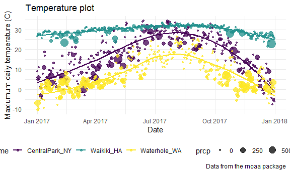
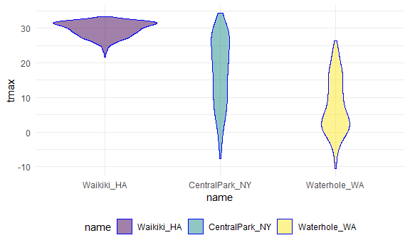

Visualization
================

``` r
library(tidyverse)
```

    ## -- Attaching packages ----------------------------------------------- tidyverse 1.3.0 --

    ## v ggplot2 3.3.2     v purrr   0.3.4
    ## v tibble  3.0.3     v dplyr   1.0.2
    ## v tidyr   1.1.2     v stringr 1.4.0
    ## v readr   1.3.1     v forcats 0.5.0

    ## -- Conflicts -------------------------------------------------- tidyverse_conflicts() --
    ## x dplyr::filter() masks stats::filter()
    ## x dplyr::lag()    masks stats::lag()

``` r
library(patchwork)
```

Global settings for themes (for figures).

``` r
knitr::opts_chunk$set(
  fig.width = 6,
  fig.asp = .6,          #aspect ratio: height over width
  out.width = "90%"      # figure doesn't go all the way out on full(100%) page
)
theme_set(theme_minimal() + theme(legend.position = "bottom"))

options(
  ggplot2.continuous.colour = "viridis", # to override ggplot default colors.
  ggplot2.continuous.fill = "viridis"
)

scale_colour_discrete = scale_colour_viridis_d
scale_fill_discrete = scale_fill_viridis_d
```

Load NOAA weather data.

``` r
weather_df = 
  rnoaa::meteo_pull_monitors(
    c("USW00094728", "USC00519397", "USS0023B17S"),
    var = c("PRCP", "TMIN", "TMAX"), 
    date_min = "2017-01-01",
    date_max = "2017-12-31") %>%
  mutate(
    name = recode(
      id, 
      USW00094728 = "CentralPark_NY", 
      USC00519397 = "Waikiki_HA",
      USS0023B17S = "Waterhole_WA"),
    tmin = tmin / 10,            #data stored is in 10th of degree C
    tmax = tmax / 10) %>%
  select(name, id, everything())
```

    ## Registered S3 method overwritten by 'hoardr':
    ##   method           from
    ##   print.cache_info httr

    ## using cached file: C:\Users\arunp\AppData\Local\cache/R/noaa_ghcnd/USW00094728.dly

    ## date created (size, mb): 2020-10-03 16:57:15 (7.537)

    ## file min/max dates: 1869-01-01 / 2020-10-31

    ## using cached file: C:\Users\arunp\AppData\Local\cache/R/noaa_ghcnd/USC00519397.dly

    ## date created (size, mb): 2020-10-03 16:57:25 (1.703)

    ## file min/max dates: 1965-01-01 / 2020-03-31

    ## using cached file: C:\Users\arunp\AppData\Local\cache/R/noaa_ghcnd/USS0023B17S.dly

    ## date created (size, mb): 2020-10-03 16:57:29 (0.882)

    ## file min/max dates: 1999-09-01 / 2020-10-31

part 1 plot: tmax vs tmin

``` r
weather_df %>% 
  ggplot(aes(x = tmin, y = tmax, color = name)) + 
  geom_point(alpha = .5)
```

    ## Warning: Removed 15 rows containing missing values (geom_point).


Labels

``` r
weather_df %>% 
  ggplot(aes(x = tmin, y = tmax, color = name)) + 
  geom_point(alpha = .5) + 
  labs(
    title = "Temperature plot",
    x = "Minimum daily temperature (C)",
    y = "Maxiumum daily temperature (C)",
    caption = "Data from the rnoaa package: temperatures in 2017"
  )
```

    ## Warning: Removed 15 rows containing missing values (geom_point).


Scales

``` r
weather_df %>% 
  ggplot(aes(x = tmin, y = tmax)) + 
  geom_point(aes(color = name), alpha = .5) + 
  labs(
    title = "Temperature plot",
    x = "Minimum daily temperature (C)",
    y = "Maxiumum daily temperature (C)",
    caption = "Data from the rnoaa package") + 
  scale_x_continuous(            #x-variable is continuous. Discrete more common.
    breaks = c(-15, 0, 15), 
    labels = c("-15º C", "0", "15"))
```

    ## Warning: Removed 15 rows containing missing values (geom_point).


Scaling aesthetics

``` r
weather_df %>% 
  ggplot(aes(x = tmin, y = tmax)) + 
  geom_point(aes(color = name), alpha = .5) + 
  labs(
    title = "Temperature plot",
    x = "Minimum daily temperature (C)",
    y = "Maxiumum daily temperature (C)",
    caption = "Data from the rnoaa package") + 
  scale_color_hue(name = "Location", h = c(100, 300)) #call "name"-var location.
```

    ## Warning: Removed 15 rows containing missing values (geom_point).


Using “viridis” package for colors(better visually, and for printing).

``` r
ggp_temp_plot = 
  weather_df %>% 
  ggplot(aes(x = tmin, y = tmax)) + 
  geom_point(aes(color = name), alpha = .5) + 
  labs(
    title = "Temperature plot",
    x = "Minimum daily temperature (C)",
    y = "Maxiumum daily temperature (C)",
    caption = "Data from the rnoaa package"
  ) + 
  viridis::scale_color_viridis(
    name = "Location", 
    discrete = TRUE    #since mapping color to discrete var, skip if var is cont.
  )

ggp_temp_plot
```

    ## Warning: Removed 15 rows containing missing values (geom_point).


Using “Theme” to move legend position to the bottom.

``` r
ggp_temp_plot + 
  theme(legend.position = "bottom")
```

    ## Warning: Removed 15 rows containing missing values (geom_point).


Learning assessment: tmax against date ————–

``` r
weather_df %>% 
  ggplot(aes(x = date, y = tmax)) + 
  geom_point(aes(color = name), alpha = .5) + 
  labs(
    title = "temeprature by date",
    x = "Date",
    y = "Maxiumum daily temperature (C)",
    caption = "Data from the rnoaa package") + 
  scale_color_hue(name = "Location", h = c(100, 300)) +
  theme_bw() +                               # graph paper black & white
  theme(legend.position = "bottom")          # legend at the bottom  
```

    ## Warning: Removed 3 rows containing missing values (geom_point).


OR

``` r
ggplot(weather_df, aes(x = date, y = tmax, color = name)) + 
  geom_smooth(se = FALSE) +                        # for smooth lines
  geom_point(aes(size = prcp), alpha = .75) +     # for scatterplot points  
  labs(
    title = "Temperature plot",
    x = "Date",
    y = "Maxiumum daily temperature (C)",
    caption = "Data from the rnoaa package"
  ) + 
  viridis::scale_color_viridis(discrete = TRUE) + 
  theme_minimal() + 
  theme(legend.position = "bottom")
```

    ## `geom_smooth()` using method = 'loess' and formula 'y ~ x'

    ## Warning: Removed 3 rows containing non-finite values (stat_smooth).

    ## Warning: Removed 3 rows containing missing values (geom_point).


End learning assessment ——————————

## Data args in `geom`

``` r
central_park =
  weather_df %>% 
  filter(name == "CentralPark_NY")

waikiki =
  weather_df %>% 
  filter(name == "Waikiki_HA")

ggplot(data = waikiki, aes(x = date, y = tmax, color = name)) +
  geom_point() +   # uses waikiki data since () blank
  geom_line(data = central_park)     # left to right connects the dots, if () blank do it for waikiki, otherwise for name specified.
```

    ## Warning: Removed 3 rows containing missing values (geom_point).


Patchwork (for multi-panel plots)

``` r
tmax_tmin_p = 
  weather_df %>% 
  ggplot(aes(x = tmax, y = tmin, color = name)) + 
  geom_point(alpha = .5) +
  theme(legend.position = "none")

prcp_dens_p = 
  weather_df %>% 
  filter(prcp > 0) %>%    # otherwise too many zero days on the graph
  ggplot(aes(x = prcp, fill = name)) + 
  geom_density(alpha = .5) + 
  theme(legend.position = "none")

tmax_date_p = 
  weather_df %>% 
  ggplot(aes(x = date, y = tmax, color = name)) + 
  geom_point(alpha = .5) +
  geom_smooth(se = FALSE) + 
  theme(legend.position = "bottom")

(tmax_tmin_p + prcp_dens_p) / tmax_date_p  # specify layout of the 3 plots
```

    ## Warning: Removed 15 rows containing missing values (geom_point).

    ## `geom_smooth()` using method = 'loess' and formula 'y ~ x'

    ## Warning: Removed 3 rows containing non-finite values (stat_smooth).

    ## Warning: Removed 3 rows containing missing values (geom_point).


## Data manipulation

1.  reorder name by hand, using “forecast” package and “factor re-level”
    function.

<!-- end list -->

``` r
weather_df %>%
  mutate(name = forcats::fct_relevel(name, c("Waikiki_HA", "CentralPark_NY", "Waterhole_WA"))) %>% 
  ggplot(aes(x = name, y = tmax)) + 
  geom_violin(aes(fill = name), color = "blue", alpha = .5) + 
  theme(legend.position = "bottom")
```

    ## Warning: Removed 3 rows containing non-finite values (stat_ydensity).



2.  Reorder name according to tmax values.

<!-- end list -->

``` r
weather_df %>%
  mutate(name = forcats::fct_reorder(name, tmax)) %>% 
  ggplot(aes(x = name, y = tmax)) + 
  geom_violin(aes(fill = name), color = "blue", alpha = .5) + 
  theme(legend.position = "bottom")
```

    ## Warning: Removed 3 rows containing non-finite values (stat_ydensity).


Densities for tmax and tmin simultaneously(using central park as
example).

``` r
weather_df %>% 
  filter(name == "CentralPark_NY") %>% 
  pivot_longer(
    tmax:tmin,     # pivot these two columns
    names_to = "observation", #list names of columns under new "observations"column
    values_to = "temperatures"
  ) %>% 
  ggplot(aes(x = temperatures, fill = observation)) +
  geom_density(alpha = 0.5) #gives temp distr for tmax and temp distr for tmin in NY
```


Same density plot for all locations by faceting

``` r
weather_df %>% 
   pivot_longer(
    tmax:tmin,     # pivot these two columns
    names_to = "observation", #list names of columns under new "observations"column
    values_to = "temperatures"
  ) %>% 
  ggplot(aes(x = temperatures, fill = observation)) +
  geom_density(alpha = 0.5) + #gives temp distr for tmax, tmin in NY
  facet_grid(.~name)
```

    ## Warning: Removed 18 rows containing non-finite values (stat_density).


